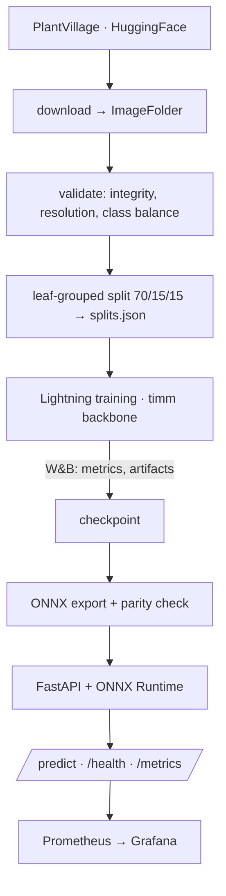

# CropGuard

Production MLOps pipeline for crop disease detection — 38-class leaf classifier trained on
PlantVillage, served as a CPU-only ONNX API with experiment tracking, statistical A/B testing,
and drift monitoring. Runs entirely on free tiers.

> **Live API: https://cropguard-api-w9ch.onrender.com** — `/health` · `/predict` · `/metrics`
>
> **Status: baseline trained, evaluated and deployed.** Calibration, the challenger model and
> drift detection are still open — see [Roadmap](#roadmap).

## Results

ResNet50, 12 epochs, evaluated on a **leak-free** 8,125-image holdout:

| Metric | Value |
|---|---|
| Test accuracy | **0.9911** |
| Test macro-F1 | **0.9865** |
| Best val macro-F1 | 0.9926 |
| Test leaf leakage | **0.0%** |

Macro-F1 is the number to read: the dataset is imbalanced ~36×, so accuracy is dominated by
the largest classes.

**The leakage result.** The standard PlantVillage split leaves 74.2% of test images sharing a
physical leaf with training. Removing that entirely did **not** reduce accuracy — best
validation macro-F1 was 0.9926 grouped against 0.9921 naive, i.e. the contaminated split
scored marginally *lower*. Different validation sets, so not a paired comparison, but the
direction is opposite to what leakage-inflation predicts.

The honest conclusion is that PlantVillage is genuinely easy rather than that its published
figures are artifacts. The grouped split still matters — a 74%-contaminated holdout would make
every downstream statistical test answer the wrong question — but the inflation everyone
assumes is not there. See [`brain.md`](brain.md) §0.

**Where the errors are.** ~72 misclassifications, concentrated in two biologically plausible
pairs: corn *Cercospora ↔ Northern Leaf Blight*, and tomato *Early ↔ Late blight*. Note that
`Potato___healthy` has only 24 test images, so its 0.833 recall is four mistakes with a ±15pp
confidence interval — ten classes fall below 100 test images and their per-class numbers
should not be read as precise.

### Production latency — measured, not estimated

| Environment | CPU | Median inference |
|---|---|---|
| Local benchmark | i5-12450H, all cores | **24 ms** |
| **Render free tier** | **0.1 vCPU** | **3504 ms** |

146×. Nothing is broken — ResNet50 at 224×224 is ~4 GFLOPs and the free tier allocates a tenth
of a core. It is stated here rather than buried because a latency number without its hardware
is not a result, and every performance claim in this project changed between the two machines.

The first fix worth trying is a **smaller backbone**, not quantization: MobileNetV3 is ~18×
fewer FLOPs, and on a dataset this easy the accuracy cost is likely small. Serving a
25.6M-parameter ResNet50 to classify leaves is the actual inefficiency.

## Architecture



The repo is split by runtime environment so the serving image never pulls in torch:

| Package | Install | Runs on |
|---|---|---|
| `cropguard.data` | `pip install ".[data]"` | anywhere (dataset prep) |
| `cropguard.training` | `pip install ".[train]"` | Colab / Lightning AI GPU |
| `cropguard.serving` | `pip install ".[serve]"` | Render free tier (CPU, no torch) |

`configs/classes.json` is the single source of truth for label order and is shared by training,
ONNX export, and the API — the one file that must never drift between the three.

## Quickstart

```bash
python -m pip install -e ".[data,serve,dev]"

# 1. Data — omit --limit-per-class for the full 54K-image dataset
export CROPGUARD_DATA_DIR=/path/outside/onedrive     # Windows: set CROPGUARD_DATA_DIR=C:\cropguard-data
python -m cropguard.data.download --config configs/base.yaml --limit-per-class 40
python -m cropguard.data.validate --config configs/base.yaml --min-samples-per-class 40
python -m cropguard.data.split    --config configs/base.yaml

# 2. Train (needs .[train]; GPU strongly recommended)
python -m cropguard.training.train --config configs/resnet50_baseline.yaml --fast-dev-run
python -m cropguard.training.train --config configs/resnet50_baseline.yaml

# 3. Export for serving
python -m cropguard.serving.onnx_export \
    --ckpt checkpoints/resnet50-baseline/best-....ckpt \
    --out models/cropguard.onnx --quantize

# 4. Serve
uvicorn cropguard.serving.app:app --port 8000
curl -F "file=@leaf.jpg" http://localhost:8000/predict
```

`--limit-per-class` builds a small subset for smoke tests. Training is resumable — checkpoints
are written every epoch and `--resume <ckpt>` picks up after a Colab/Lightning disconnect.

### The split is grouped by leaf, on purpose

PlantVillage contains 54,305 images of only ~7,600 distinct physical leaves — roughly 7 shots
of each leaf from different angles. A plain per-image stratified split scatters those
near-duplicates across train and test, letting a model memorize a leaf and "recognize" it
again at test time. Measured on this dataset:

| Split strategy | test images sharing a leaf with train |
|---|---|
| `--strategy stratified` (naive) | **74.2%** |
| `--strategy grouped` (default) | **0.0%** |

`grouped` packs whole leaf groups per class, largest-first, into whichever split is furthest
below target. It holds every class to within ~0.1pp of the requested fractions (mean
`|test_frac - 0.15|` = 0.0012) while keeping group integrity exact — 0 of 20,015 groups span
a split boundary.

This matters beyond tidiness: accuracy on the naive split is inflated, and any A/B test built
on it measures memorization rather than generalization. `--strategy stratified` is retained
only so that gap can be quantified and reported. `<data_root>/split_report.json` records the
strategy and the leakage measurement for whichever split you ran.

### Data location on Windows

Point `CROPGUARD_DATA_DIR` at a path **outside OneDrive** (e.g. `C:\cropguard-data`). OneDrive
sync on 54K small files is slow and can lock files mid-write during training.

## API

| Endpoint | Description |
|---|---|
| `POST /predict` | multipart image → `predicted_class`, `confidence`, `top_k`, `uncertainty`, `calibrated`, `model_version`, `latency_ms` |
| `POST /predict/batch` | up to 8 images; per-image errors rather than all-or-nothing |
| `GET /health` | `healthy` / `degraded` (model not loaded), model version, uptime |
| `GET /metrics` | Prometheus: request counts, latency histogram, confidence histogram |

Uploads are validated before inference: JPEG/PNG only, ≥128px on the short side, ≤10MB.
The API starts `degraded` rather than crashing when no model is present, so the container is
deployable before the first model exists.

`uncertainty` is currently normalized predictive entropy in [0, 1]; MC-dropout and ensemble
variance land with the calibration work.

**Confidence is capped at ~0.90 in the raw softmax by design.** Label smoothing (ε=0.1, K=38) bounds the
achievable softmax output at `(1−ε) + ε/K = 0.9026`, and live predictions sit exactly there
(median 0.9025). That is the loss function working as intended, not model uncertainty — but it
means the raw number should not be read as a probability. Set `CROPGUARD_TEMPERATURE=0.5908`
to serve calibrated confidence; responses carry a `calibrated` flag either way. See
[`brain.md`](brain.md) §7.1.

### Configuration

All settings are env vars with the `CROPGUARD_` prefix:

| Variable | Default | Purpose |
|---|---|---|
| `CROPGUARD_MODEL_PATH` | `models/cropguard.onnx` | ONNX weights |
| `CROPGUARD_CLASSES_PATH` | `configs/classes.json` | label order |
| `CROPGUARD_MODEL_VERSION` | `v0.1.0-baseline` | reported in responses + metrics |
| `CROPGUARD_CORS_ORIGINS` | `localhost:5173,localhost:8501` | comma-separated allowlist, not `*` |
| `CROPGUARD_TEMPERATURE` | `1.0` | calibration; `0.5908` for this model |
| `CROPGUARD_MAX_BATCH_SIZE` | `8` | images per `/predict/batch` |
| `CROPGUARD_DATA_DIR` | `data` | dataset root (overrides config) |
| `CROPGUARD_HF_REPO` | unset | HF Hub repo to pull weights from at startup |

## Docker

```bash
# Weights fetched from HF Hub on startup
docker build -t cropguard .
docker run -p 8000:8000 -e CROPGUARD_HF_REPO=<user>/cropguard-models cropguard

# Or bake them into the image (faster cold starts)
docker build --build-arg CROPGUARD_HF_REPO=<user>/cropguard-models -t cropguard .
docker run -p 8000:8000 cropguard
```

CPU-only ONNX Runtime, no torch — the image stays well under 500MB. It runs as a non-root
user and ships a `HEALTHCHECK`. With no model available the API starts *degraded* rather than
crashing, so the container is deployable and health-checkable before a model exists.

### Why fp32 is served, not INT8

| | fp32 | dynamic INT8 | static INT8 |
|---|---|---|---|
| Size | 94.3 MB | 23.8 MB | 23.8 MB |
| Latency (batched, i5-12450H) | **24.4 ms** | 1569 ms | 78.0 ms |
| Conv op | `Conv` | `ConvInteger` | `QLinearConv` |
| Accuracy (n=3000) | 0.9893 | — | 0.9897 (n.s.) |

`quantize_dynamic` rewrites every `Conv` into `ConvInteger`, which ONNX Runtime's CPU backend
has no optimized kernel for — a **75× regression**. Dynamic quantization suits
MatMul-dominated models (Transformers, RNNs), not CNNs. `cropguard.serving.quantize` does it
properly with calibration and emits `QLinearConv`, which is 20× faster.

It is still 3.2× slower than fp32 **on this hardware**, because an i5-12450H has no VNNI
instructions and INT8 convolution needs one to beat tuned fp32 FMA kernels. Server CPUs
generally do have AVX-512 VNNI, so this benchmark does not settle the question — **the
measurement that decides is the one taken on the deployment target**, and it hasn't been taken
yet. fp32 ships until then. See [`brain.md`](brain.md) §9.

## Deployment (Render free tier)

`render.yaml` is a Render Blueprint — **New → Blueprint** in the dashboard, pointed at this
repo, builds the Dockerfile and wires up the service. Model weights come from HuggingFace Hub
via `CROPGUARD_HF_REPO`, so the ONNX file never has to live in git.

Free-tier realities worth knowing before relying on it:

| Limit | Consequence |
|---|---|
| 512 MB RAM | ONNX Runtime + ResNet50 fp32 (94MB) fits, without much headroom |
| 0.1 vCPU | Inference is seconds per image, not milliseconds |
| Sleeps after 15 min idle | ~50s cold start, plus a ~26MB weight re-download |

The Dockerfile's `CROPGUARD_HF_REPO` build ARG carries a default, which is what bakes the
weights into the image — Render never forwards Blueprint env vars into a Docker build, so
anything needing a passed `--build-arg` would silently fall back to downloading 94MB on every
cold start.

If 0.1 vCPU proves too slow for a demo, HuggingFace Spaces (2 vCPU / 16GB, free) is better
hardware, though a weaker "production deployment" story.

## Experiments

| Config | Backbone | Augmentation | Role |
|---|---|---|---|
| `configs/resnet50_baseline.yaml` | ResNet50 | medium | baseline |
| `configs/convnext_tiny.yaml` | ConvNeXt-Tiny | heavy | challenger |

Configs use single-level `extends: base.yaml` inheritance with a deep merge, so a child can
override `train.lr` without losing the rest of the `train` block.

Set `WANDB_MODE=offline` (or leave `WANDB_API_KEY` unset) to train without Weights & Biases.

## Calibration

A 99% accurate model can still be badly calibrated, and this one was — in the *under*-confident
direction, which is the less common one:

| | ECE | MCE | Brier | mean confidence | accuracy |
|---|---|---|---|---|---|
| Raw softmax | 0.0895 | 0.2777 | 0.0217 | 0.9020 | 0.9911 |
| **Temperature-scaled (T = 0.591)** | **0.0036** | 0.3377 | **0.0138** | 0.9946 | 0.9911 |

```bash
python -m cropguard.evaluation.calibrate     --val artifacts/preds_val.npz --test artifacts/preds_fp32.npz     --out artifacts/calibration.json
```

**ECE fell 96%**, and accuracy is provably unchanged — dividing logits by a positive scalar is
monotonic, so no prediction can move. T is fitted on **validation only**; fitting on test would
tune the calibration to the set used to report it.

`T = 0.591 < 1` means *sharpening*: the model was under-confident. That is exactly what label
smoothing predicts (ε=0.1, K=38 ⇒ ceiling 0.9026), and mean confidence before calibration was
0.9020. Theory and measurement agree.

**MCE rose**, which is expected rather than a defect: calibration concentrated 8,042 of 8,125
predictions into one high-confidence bin, leaving sparse bins where a few errors make a large
gap. ECE is population-weighted; MCE is a max over bins including tiny ones. See
[`brain.md`](brain.md) §8.8.

## Error analysis

Per-class metrics carry **Wilson score intervals**, because per-class recall is a binomial
proportion and ten classes have fewer than 100 test images:

```
Potato___healthy      n=24   R=0.833 [0.641, 0.933]   <- four mistakes; do not read as 0.833
Corn___Cercospora     n=77   R=0.922 [0.840, 0.964]
Tomato___Early_blight n=149  R=0.913 [0.856, 0.948]
```

The confusion structure says more than any single number:

| True → Predicted | Count | |
|---|---|---|
| Tomato Early blight → Late blight | 8 | bidirectional |
| Corn Cercospora ↔ Northern Leaf Blight | 6 + 3 | bidirectional |
| Tomato Spider mites → Target Spot | 6 | |
| Potato Late blight → Tomato Late blight | 3 | *same pathogen, different host* |

The four most-confident mistakes all fall in these pairs rather than scattering — which is the
reassuring shape, since scattered confident errors would suggest something spurious had been
learned.

## Demo UI

```bash
pip install -e ".[demo]"
streamlit run app/streamlit_app.py
```

Upload a leaf and get the prediction, top-3, confidence, uncertainty, and both latencies —
against the live API or a local ONNX model. It shows the confidence ceiling explicitly rather
than presenting ~0.90 as a calibrated probability.

## Statistical model comparison

Accuracy going up is not evidence that a model is better. `cropguard.evaluation` runs the
paired tests that decide whether a difference survives resampling, and whether it is large
enough to care about:

```bash
python -m cropguard.evaluation.predict --model models/baseline.onnx   --split test --out artifacts/preds_baseline.npz
python -m cropguard.evaluation.predict --model models/challenger.onnx --split test --out artifacts/preds_challenger.npz
python -m cropguard.evaluation.compare \
    --baseline artifacts/preds_baseline.npz \
    --challenger artifacts/preds_challenger.npz \
    --out artifacts/comparison.json
```

```
n=8125 holdout images
accuracy: A=0.9047  B=0.9294  (diff +0.0246)
McNemar (chi-squared, continuity corrected): discordant 228 vs 428 (B > A), p=7.9e-15 -> significant
Bootstrap (10000 resamples): diff=+0.0246, 95% CI [+0.0185, +0.0306] -> excludes 0
Paired t-test: mean diff=+0.0245, t=6.647, p=8.4e-08 -> significant; d=+1.078 (large)
Power=1.000 at n=38 -> adequately powered (>=0.8)
VERDICT: challenger is significantly better
```

- **McNemar's test** — the standard paired test for two classifiers on one holdout. Only
  discordant pairs carry information; it switches to an exact binomial when they are scarce.
- **Bootstrap CI** — 10,000 paired resamples of the accuracy difference. Both models are
  resampled on the same indices, which preserves the pairing and tightens the interval.
- **Per-class paired t-test + Cohen's d_z** — asks whether the gain is spread across classes
  or concentrated in the common ones.
- **Power analysis** — reported alongside every null result, because "not significant" from an
  underpowered test means *we could not tell*, not *there is no difference*.

`compare` exits non-zero unless the challenger wins, so CI can gate model promotion on
statistical evidence instead of a raw accuracy delta. Inference runs through the exported ONNX
graph and the serving preprocessor, so these numbers are the ones production actually produces.

## Development

```bash
python -m pip install -e ".[data,serve,dev]"
python -m pytest          # torch-dependent tests skip automatically if torch is absent
python -m ruff check .
```

Tests build a synthetic ImageFolder dataset and a tiny ONNX graph in `tmp_path`, so the full
suite runs without PlantVillage and without a trained model. `test_preprocess.py` pins the
NumPy serving preprocessor against torchvision's `eval_transforms` — that comparison is the
guard against training/serving skew.

## Roadmap

- [x] Data pipeline: download, validation, leakage-free leaf-grouped split
- [x] Lightning training loop, W&B logging, resumable checkpoints
- [x] ONNX export with PyTorch parity check
- [x] Static INT8 quantization — built and measured; **not deployed**, see below
- [x] FastAPI serving, Prometheus metrics, Docker image
- [x] Test suite and CI
- [x] Hypothesis testing: McNemar, bootstrap CI, Cohen's d, power analysis
- [x] Train the ResNet50 baseline (99.11% / 0.9865 macro-F1, leak-free holdout)
- [x] Leakage ablation: measured, and the inflation is not there
- [x] Publish weights to HF Hub ([`XiElonMAsk/cropguard-models`](https://huggingface.co/XiElonMAsk/cropguard-models))
- [x] Deploy to Render — live, with real latency measured
- [ ] ConvNeXt-Tiny challenger and the first real A/B comparison
- [x] Calibration: temperature scaling, ECE/MCE/Brier, reliability curves
- [x] Error analysis: Wilson intervals, confusion pairs, confident mistakes
- [x] Streamlit demo UI
- [x] Apply the fitted temperature in the serving path
- [ ] MC-dropout / ensemble uncertainty
- [ ] Error and subgroup analysis (lab vs. field photos)
- [ ] `/feedback` endpoint and drift detection (PSI, KS test) with retraining triggers
- [ ] Render deployment, load testing, Grafana dashboard
