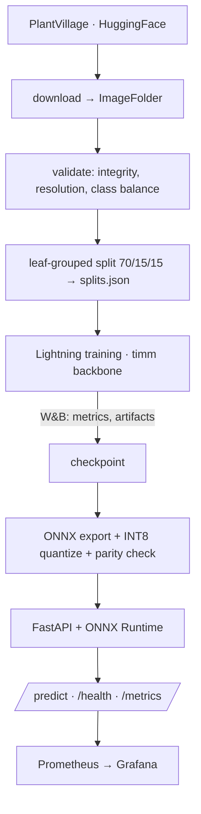

# CropGuard

Production MLOps pipeline for crop disease detection — 38-class leaf classifier trained on
PlantVillage, served as a CPU-only ONNX API with experiment tracking, statistical A/B testing,
and drift monitoring. Runs entirely on free tiers.

> **Status: pipeline scaffolding complete, model not yet trained.** Every stage below runs, but
> the numbers in the results table are placeholders until the baseline finishes training. See
> [Roadmap](#roadmap).

## Architecture



The repo is split by runtime environment so the serving image never pulls in torch:

| Package | Install | Runs on |
|---|---|---|
| `cropguard.data` | `pip install ".[data]"` | anywhere (dataset prep) |
| `cropguard.training` | `pip install ".[train]"` | Colab / Lightning AI GPU |
| `cropguard.serving` | `pip install ".[serve]"` | Render free tier (CPU, no torch) |

`configs/classes.json` is the single source of truth for label order and is shared by training,
ONNX export, and the API — the one file that must never drift between the three.

## Quickstart

```bash
python -m pip install -e ".[data,serve,dev]"

# 1. Data — omit --limit-per-class for the full 54K-image dataset
export CROPGUARD_DATA_DIR=/path/outside/onedrive     # Windows: set CROPGUARD_DATA_DIR=C:\cropguard-data
python -m cropguard.data.download --config configs/base.yaml --limit-per-class 40
python -m cropguard.data.validate --config configs/base.yaml --min-samples-per-class 40
python -m cropguard.data.split    --config configs/base.yaml

# 2. Train (needs .[train]; GPU strongly recommended)
python -m cropguard.training.train --config configs/resnet50_baseline.yaml --fast-dev-run
python -m cropguard.training.train --config configs/resnet50_baseline.yaml

# 3. Export for serving
python -m cropguard.serving.onnx_export \
    --ckpt checkpoints/resnet50-baseline/best-....ckpt \
    --out models/cropguard.onnx --quantize

# 4. Serve
uvicorn cropguard.serving.app:app --port 8000
curl -F "file=@leaf.jpg" http://localhost:8000/predict
```

`--limit-per-class` builds a small subset for smoke tests. Training is resumable — checkpoints
are written every epoch and `--resume <ckpt>` picks up after a Colab/Lightning disconnect.

### The split is grouped by leaf, on purpose

PlantVillage contains 54,305 images of only ~7,600 distinct physical leaves — roughly 7 shots
of each leaf from different angles. A plain per-image stratified split scatters those
near-duplicates across train and test, letting a model memorize a leaf and "recognize" it
again at test time. Measured on this dataset:

| Split strategy | test images sharing a leaf with train |
|---|---|
| `--strategy stratified` (naive) | **74.2%** |
| `--strategy grouped` (default) | **0.0%** |

`grouped` packs whole leaf groups per class, largest-first, into whichever split is furthest
below target. It holds every class to within ~0.1pp of the requested fractions (mean
`|test_frac - 0.15|` = 0.0012) while keeping group integrity exact — 0 of 20,015 groups span
a split boundary.

This matters beyond tidiness: accuracy on the naive split is inflated, and any A/B test built
on it measures memorization rather than generalization. `--strategy stratified` is retained
only so that gap can be quantified and reported. `<data_root>/split_report.json` records the
strategy and the leakage measurement for whichever split you ran.

### Data location on Windows

Point `CROPGUARD_DATA_DIR` at a path **outside OneDrive** (e.g. `C:\cropguard-data`). OneDrive
sync on 54K small files is slow and can lock files mid-write during training.

## API

| Endpoint | Description |
|---|---|
| `POST /predict` | multipart image → `predicted_class`, `confidence`, `top_k`, `uncertainty`, `model_version`, `latency_ms` |
| `GET /health` | `healthy` / `degraded` (model not loaded), model version, uptime |
| `GET /metrics` | Prometheus: request counts, latency histogram, confidence histogram |

Uploads are validated before inference: JPEG/PNG only, ≥128px on the short side, ≤10MB.
The API starts `degraded` rather than crashing when no model is present, so the container is
deployable before the first model exists.

`uncertainty` is currently normalized predictive entropy in [0, 1]; MC-dropout and ensemble
variance land with the calibration work.

### Configuration

All settings are env vars with the `CROPGUARD_` prefix:

| Variable | Default | Purpose |
|---|---|---|
| `CROPGUARD_MODEL_PATH` | `models/cropguard.int8.onnx` | ONNX weights |
| `CROPGUARD_CLASSES_PATH` | `configs/classes.json` | label order |
| `CROPGUARD_MODEL_VERSION` | `v0.1.0-baseline` | reported in responses + metrics |
| `CROPGUARD_CORS_ORIGINS` | `http://localhost:5173` | comma-separated |
| `CROPGUARD_DATA_DIR` | `data` | dataset root (overrides config) |
| `CROPGUARD_HF_REPO` | unset | HF Hub repo to pull weights from at startup |

## Docker

```bash
docker build -t cropguard .
docker run -p 8000:8000 -e CROPGUARD_HF_REPO=<user>/cropguard-models cropguard
```

CPU-only ONNX Runtime, no torch — the image stays well under 500MB. If `models/` is empty at
build time, `scripts/fetch_model.py` pulls weights from HF Hub on startup instead.

## Experiments

| Config | Backbone | Augmentation | Role |
|---|---|---|---|
| `configs/resnet50_baseline.yaml` | ResNet50 | medium | baseline |
| `configs/convnext_tiny.yaml` | ConvNeXt-Tiny | heavy | challenger |

Configs use single-level `extends: base.yaml` inheritance with a deep merge, so a child can
override `train.lr` without losing the rest of the `train` block.

Set `WANDB_MODE=offline` (or leave `WANDB_API_KEY` unset) to train without Weights & Biases.

## Statistical model comparison

Accuracy going up is not evidence that a model is better. `cropguard.evaluation` runs the
paired tests that decide whether a difference survives resampling, and whether it is large
enough to care about:

```bash
python -m cropguard.evaluation.predict --model models/baseline.onnx   --split test --out artifacts/preds_baseline.npz
python -m cropguard.evaluation.predict --model models/challenger.onnx --split test --out artifacts/preds_challenger.npz
python -m cropguard.evaluation.compare \
    --baseline artifacts/preds_baseline.npz \
    --challenger artifacts/preds_challenger.npz \
    --out artifacts/comparison.json
```

```
n=8125 holdout images
accuracy: A=0.9047  B=0.9294  (diff +0.0246)
McNemar (chi-squared, continuity corrected): discordant 228 vs 428 (B > A), p=7.9e-15 -> significant
Bootstrap (10000 resamples): diff=+0.0246, 95% CI [+0.0185, +0.0306] -> excludes 0
Paired t-test: mean diff=+0.0245, t=6.647, p=8.4e-08 -> significant; d=+1.078 (large)
Power=1.000 at n=38 -> adequately powered (>=0.8)
VERDICT: challenger is significantly better
```

- **McNemar's test** — the standard paired test for two classifiers on one holdout. Only
  discordant pairs carry information; it switches to an exact binomial when they are scarce.
- **Bootstrap CI** — 10,000 paired resamples of the accuracy difference. Both models are
  resampled on the same indices, which preserves the pairing and tightens the interval.
- **Per-class paired t-test + Cohen's d_z** — asks whether the gain is spread across classes
  or concentrated in the common ones.
- **Power analysis** — reported alongside every null result, because "not significant" from an
  underpowered test means *we could not tell*, not *there is no difference*.

`compare` exits non-zero unless the challenger wins, so CI can gate model promotion on
statistical evidence instead of a raw accuracy delta. Inference runs through the exported ONNX
graph and the serving preprocessor, so these numbers are the ones production actually produces.

## Development

```bash
python -m pip install -e ".[data,serve,dev]"
python -m pytest          # torch-dependent tests skip automatically if torch is absent
python -m ruff check .
```

Tests build a synthetic ImageFolder dataset and a tiny ONNX graph in `tmp_path`, so the full
suite runs without PlantVillage and without a trained model. `test_preprocess.py` pins the
NumPy serving preprocessor against torchvision's `eval_transforms` — that comparison is the
guard against training/serving skew.

## Roadmap

- [x] Data pipeline: download, validation, leakage-free leaf-grouped split
- [x] Lightning training loop, W&B logging, resumable checkpoints
- [x] ONNX export with INT8 quantization and PyTorch parity check
- [x] FastAPI serving, Prometheus metrics, Docker image
- [x] Test suite and CI
- [x] Hypothesis testing: McNemar, bootstrap CI, Cohen's d, power analysis
- [ ] Train baseline + challenger, publish weights to HF Hub
- [ ] Calibration: temperature scaling, ECE, reliability diagrams, MC-dropout uncertainty
- [ ] Error and subgroup analysis (lab vs. field photos)
- [ ] `/feedback` endpoint and drift detection (PSI, KS test) with retraining triggers
- [ ] Render deployment, load testing, Grafana dashboard
